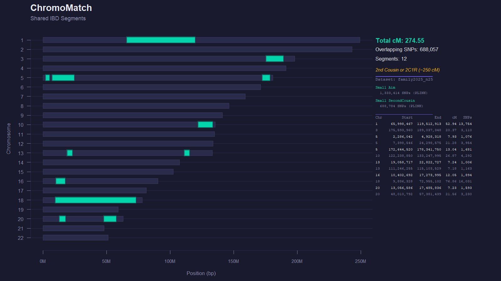

# ChromoMatch

An R script that compares two autosomal raw DNA files from consumer genetic testing services and identifies shared IBD (identical-by-descent) segments in centimorgans (cM). Useful for genetic genealogy research to determine biological relationships between two individuals.

## Features

- **Multi-format support** — Automatically detects and parses raw DNA files from 23andMe, AncestryDNA, and Family Tree DNA (FTDNA)
- **Genetic map integration** — Uses PLINK or HapMap recombination maps for accurate bp-to-cM conversion; auto-downloads the Beagle GRCh37 map if none is provided
- **Seed-and-extend IBD detection** — Sliding-window algorithm that distinguishes true shared segments from background noise (~93% of SNPs match between any two humans by chance)
- **Chromosome visualization** — Generates a PNG plot showing all 22 autosomes with shared segments highlighted, plus a summary table
- **Relationship estimation** — Estimates probable relationship based on total shared cM using Blaine Bettinger's Shared cM Project ranges
- **Dual execution modes** — Run from the command line with arguments or interactively in RStudio
- **Single dependency** — Requires only the `data.table` package (auto-installed if missing)

## Quick Start

### Command Line

```bash
Rscript chromomatch.R person1_23andme.txt person2_ancestry.txt \
  --genetic-map ./genetic_map_grch37 \
  --output results.csv
```

### RStudio Interactive

Open `chromomatch.R`, uncomment and edit the configuration section near the top:

```r
file1           <- "C:/path/to/person1.txt"
file2           <- "C:/path/to/person2.csv"
genetic_map_dir <- "./genetic_map_grch37"
```

Then select all and click **Run**.

## Supported File Formats

| Service | Format | Separator | Columns |
|---------|--------|-----------|---------|
| **23andMe** | Tab-delimited, `#` comment headers | Tab | rsid, chromosome, position, genotype |
| **AncestryDNA** | Tab-delimited, `#` comment headers | Tab | rsid, chromosome, position, allele1, allele2 |
| **FTDNA** | CSV with quoted fields, 1-line header | Comma | RSID, CHROMOSOME, POSITION, RESULT |

The format is auto-detected from file headers and structure. All files are assumed to use GRCh37/hg19 coordinates unless the header indicates GRCh38.

## Genetic Map

The script requires a genetic recombination map to convert base pair positions to centimorgans. It supports two common formats:

| Format | Columns | Example Files |
|--------|---------|---------------|
| **PLINK .map** | chr, snp_name, cM, position_bp | `plink.chr1.GRCh37.map` |
| **HapMap** | Chromosome, Position(bp), Rate(cM/Mb), Map(cM) | `genetic_map_chr1_b37.txt` |

If no `--genetic-map` directory is provided, the script automatically downloads the [Beagle PLINK GRCh37 map](https://bochet.gcc.biostat.washington.edu/beagle/genetic_maps/) to a temporary directory.

The column layout is auto-detected by inspecting the data types in each column.

## Output

| File | Description |
|------|-------------|
| `comparison_results.csv` | CSV with columns: Chr, Start_Position, End_Position, cM, SNPs |
| `comparison_plot.png` | Chromosome visualization with shared segments and summary stats |



## How the Algorithm Works

Any two humans share approximately 93% of SNPs as half-identical by chance — this is the "background" match rate. True IBD segments inherited from a common ancestor show near-perfect matching (~99%+), with the only mismatches coming from genotyping errors (~0.5–1.5%).

The algorithm uses a **seed-and-extend** approach to distinguish true IBD from background:

1. **Sliding window** — A window of `mismatch_bunch` SNPs (default: 250) slides across each chromosome, computing the mismatch rate within each window.

2. **Seed** — Windows with a mismatch rate at or below `seed_threshold` (default: 2%) are flagged as IBD seeds. True IBD regions will have many consecutive seed-quality windows.

3. **Extend** — Seeds expand bidirectionally into adjacent windows that fall below an adaptive extension threshold (half the observed background mismatch rate for this pair, capped at 4%).

4. **Trim** — Segment edges are trimmed back to the outermost seed-quality windows, preventing noisy boundary regions from inflating cM values.

5. **Validate** — Each candidate segment must pass three gates:
   - Overall mismatch rate ≤ 2.5%
   - For segments under 15 cM: mismatch rate ≤ 1.5%
   - At least 30% of sliding windows within the segment must be seed-quality

6. **Filter** — Segments below `min_cm` or `min_snps` are discarded.

## Tunable Parameters

| Parameter | Default | CLI Flag | Description |
|-----------|---------|----------|-------------|
| **min_cm** | 7 | `--min-cm` | Minimum segment size in cM to report. Segments below this are filtered out. Lower values (5–6) find more distant matches but increase false positives. Higher values (10+) are more conservative. |
| **min_snps** | 500 | `--min-snps` | Minimum number of SNPs a segment must span. Prevents short high-density regions from appearing as false segments. |
| **mismatch_bunch** | 250 | `--mismatch-bunch` | Sliding window size in SNPs. Larger windows (300–500) smooth out noise for better specificity but may miss short segments. Smaller windows (150–200) increase sensitivity but may produce more false positives. GEDmatch uses a dynamic average of ~208. |
| **seed_threshold** | 0.02 | `--seed-threshold` | Maximum mismatch rate within a window to qualify as an IBD seed. The default of 2% accommodates genotyping error. Lowering to 0.015 tightens detection and may trim segment edges; raising to 0.025 is more permissive. |
| **genetic_map_dir** | auto | `--genetic-map` | Path to directory containing per-chromosome genetic map files. Different maps can produce different cM values for the same physical segments — see the comparison table below. |

### Parameter Tuning Tips

- **Too many small segments?** Raise `seed_threshold` strictness (lower the value, e.g., 0.015) or increase `min_cm` to 8–10.
- **Missing known segments?** Lower `seed_threshold` to 0.025 or decrease `min_snps` to 300.
- **cM values seem high?** Try a different genetic map, or increase `seed_threshold` strictness to trim segment edges.
- **cM values seem low?** Ensure the genetic map matches the reference build of your DNA files (GRCh37 vs GRCh38).

## Validation: Three-Tool Comparison

The script was validated by comparing results for a known 1st-cousin-twice-removed pair (actual shared DNA ~250 cM) against two established tools: [GEDmatch Genesis](https://www.gedmatch.com/) and [DNAKitStudio](https://dnagenics.com/) by DNAGenics.

### Segment-by-Segment Comparison

| Chr | GEDmatch (cM) | DNAKitStudio (cM) | ChromoMatch (cM) |
|:---:|:---:|:---:|:---:|
| 1 | 23.7 | 22.77 | 25.65 |
| 2 | 22.5 | 23.01 | 25.67 |
| 6 | 22.5 | 22.06 | 23.16 |
| 8 | 15.0 | 14.98 | 16.93 |
| 8 | 22.5 | 21.78 | 22.78 |
| 9 | 19.5 | 18.09 | 21.11 |
| 11 | 17.0 | 15.74 | 16.79 |
| 13 | 13.5 | 13.31 | 13.82 |
| 14 | 94.4 | 90.80 | 91.89 |
| 16 | 7.5 | 7.50 | 9.43 |
| **Total** | **258.2** | **250.04** | **275.29** |
| **Segments** | **10** | **10** | **11** |

### Summary

| Metric | GEDmatch | DNAKitStudio | ChromoMatch |
|--------|:--------:|:------------:|:----------------:|
| Total cM | 258.2 | 250.04 | 275.29 |
| Segments | 10 | 10 | 11 |
| Overlapping SNPs | 426,384 | 557,317 | 430,766 |
| Largest segment | 94.4 | 90.80 | 91.89 |

### Discussion

All three tools identified the same 10 core IBD segments on the same chromosomes. The ChromoMatch found one additional borderline segment on chromosome 5 (8.06 cM) that was below the detection threshold of the other two tools.

The ~17–25 cM total difference is consistent with known sources of inter-tool variation:

- **Genetic map differences** — Each tool may use a different recombination map (HapMap II, HapMap III, deCODE, Beagle PLINK, or proprietary). Different maps assign different cumulative cM values at the same physical positions, causing systematic shifts across all segments.

- **Segment boundary placement** — The exact SNP where a segment starts and ends depends on each tool's windowing algorithm, mismatch tolerance, and edge-trimming logic. A difference of a few hundred SNPs at each boundary translates to 1–3 cM per segment.

- **SNP overlap set** — Different tools may filter to different SNP sets before comparison (e.g., DNAKitStudio may restrict to a specific chip array's SNP positions), affecting both boundary precision and cM calculation.

- **Dynamic vs fixed parameters** — GEDmatch uses dynamic segment thresholds (averaging ~208 SNPs with 60% mismatch-bunching), while this script uses fixed defaults. Adjusting `mismatch_bunch` to 200 and `seed_threshold` to 0.015 may bring results closer to GEDmatch.

This level of variation (~10%) is normal and expected. Commercial DNA testing services (23andMe, AncestryDNA, FTDNA) also routinely disagree by similar margins when comparing the same pair of individuals.

## Requirements

- **R** ≥ 3.5
- **data.table** package (auto-installed if missing)
- Raw DNA files from 23andMe, AncestryDNA, or FTDNA
- A genetic recombination map (auto-downloaded if not provided)

## License

This project is licensed under the GNU General Public License v3.0 - see the [LICENSE](LICENSE) file for details.
